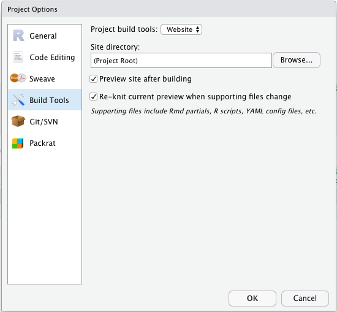

<!-- README.md is generated from README.Rmd. Please edit that file -->
 
```{r, include = FALSE}
knitr::opts_chunk$set(
  collapse = TRUE,
  comment = "#>"
)
```
# siteymlgen: Automatically generate a _site.yml for Rmarkdown websites

<!-- badges: start -->
[](https://www.tidyverse.org/lifecycle/#maturing)
[](https://github.com/Acribbs/siteymlgen/actions)
<!-- badges: end -->

siteymlgen automates the process of generating a `_site.yml` file used to control the layout of an Rmarkdown website. Often writing the _site.yml can be the most annoying task when generating a webite using Rmarkdown, particularly when there are multiple tabs and sub tabs. The `siteymlgen_init()` function should be placed in a code cell of your index.Rmd file. When your other `.Rmd` files are named according to the siteymlgen convention then the _site.yml will automatically populate. 


## Installation

You can install siteymlgen ...:

``` r
```

Or you can install the development version of siteymlgen from GitHub with:

``` r
devtools::install_github("Acribbs/siteymlgen")
```

## Naming convention

In order to control the layout of your `_site.yml` file then you will need to name your files according to the following naming convention:

[A-Z][1-9]_TitleofTab.Rmd

The first letter of the file name controls the 

# Example

R Markdown to generate a complete website and _site.yml controls the layout of this:

Put your `.Rmd` files in a single directory. `index.Rmd` will become the home page.

Add an empty YAML file named `_site.yml`, which will be populated by siteymlgen according to your file names and input options supplied to `siteymlgen_init()`.

Next configure your build tools in Rstudio so that you can build websites:



Then build your website:


# Documentation


