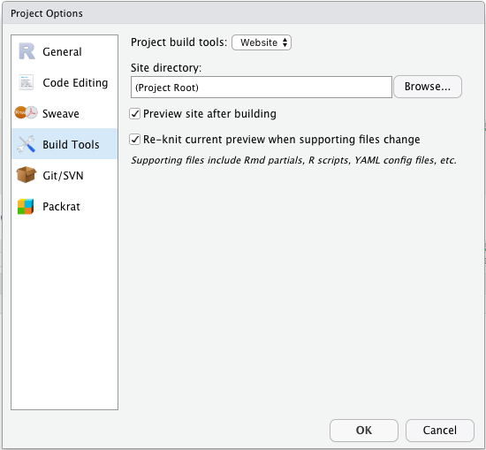

<!-- README.md is generated from README.Rmd. Please edit that file -->

# siteymlgen: Automatically generate a \_site.yml for Rmarkdown websites

<!-- badges: start -->

 [](https://github.com/Acribbs/siteymlgen/actions)
<!-- badges: end -->

siteymlgen makes it easy to organise R Markdown website output. The
init() function placed within the first code chunk of the index.Rmd file
of an R project directory will initiate the generation of an
automatically written \_site.yml file. siteymlgen recomends a specific
naming convention for your markdown files. This naming will ensure that
your navbar layout is ordered according to a heirarchy.

## Installation

You can install siteymlgen …:

``` r
```

Or you can install the development version of siteymlgen from GitHub
with:

``` r
devtools::install_github("Acribbs/siteymlgen")
```

## Naming convention

In order to control how your website navbar is ordered then you need to
stick to the following naming convention:

`[A-Z][1-9]_TitleofTab.Rmd`

e.g. `A1_FileOne.Rmd`

The capital first letter of the file name controls the layout position
of the tab in the navbar. The number controls the position within the
dropdown menu. If you would like a drop down tab menu then label your
files:

`B1_test1.Rmd`, `B2_test1.Rmd` and `B3_test1.Rmd`.

This will ultimately render as:


# Example

Included within this package is data that demonstrates the functionality
of this project. First copy the data to a new folder:

``` r
dir.create(paste0(getwd(), "/test"))
file.copy(system.file("extdata", package="siteymlgen"), paste0(getwd(), "/test"), recursive = TRUE)
```

Then naviage to the directory and create a new R project.

All `.Rmd` files should be located within a single directory.
`index.Rmd` will become the home page.

Add an empty YAML file named `_site.yml`, which will be populated by
siteymlgen according to your file names and input options supplied to
`init()`. ?pkgdown::build\_site() Set up build tools so that you can
build an R markdown website and then “Build Website”:



Then build your website:


